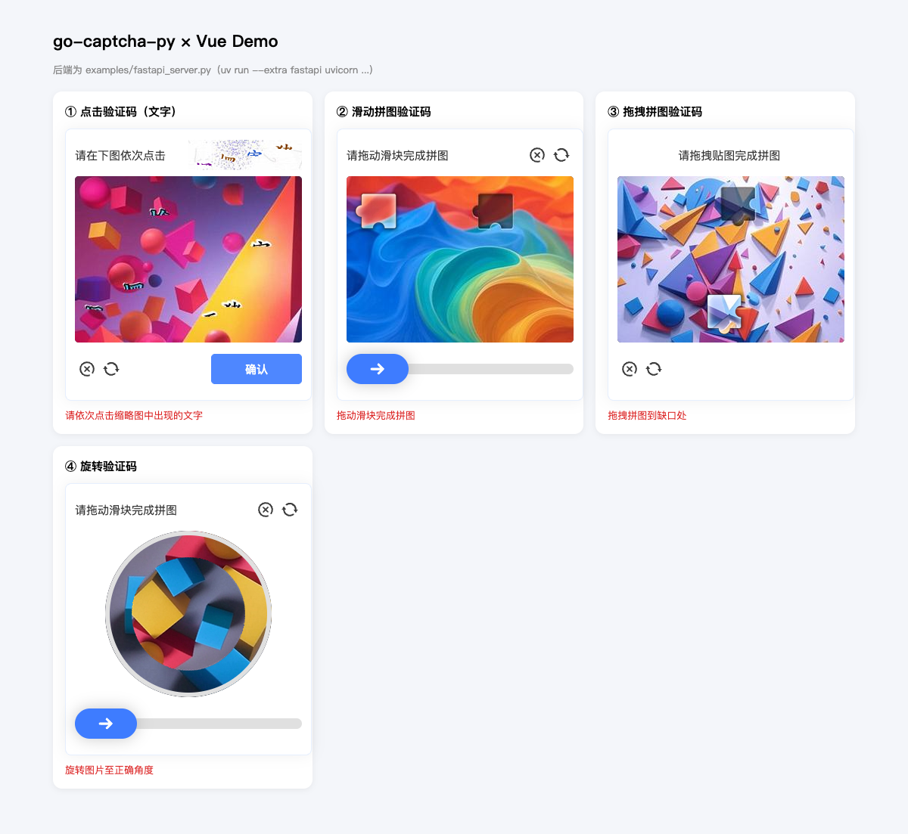
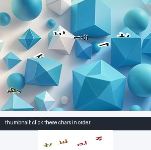
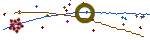

# go-captcha-py

🧩 **Python 行为验证码库** —— [GoCaptcha](https://github.com/wenlng/go-captcha) 的 Python 复现版本

支持 **点击（文字/图形）**、**滑动拼图**、**拖拽拼图**、**旋转** 四种行为验证码的生成与校验，与 GoCaptcha 官方前端组件（Vue / React / Angular / Svelte / Solid / JavaScript）**协议级兼容**，并内置全部素材资源，安装即用。



| 点击验证码（文字，主图 + 缩略图） | 点击验证码（图形） | 滑动拼图 | 旋转 |
| --- | --- | --- | --- |
|  |  |  |  |

## 特性

- **四种验证码类型**：Click（Text / Shape）、Slide（Basic / Drag-Drop）、Rotate，生成逻辑与 Go 版对齐
- **内置素材**：16 张主图、13 个图形、5 张缩略图、4 套拼图 tile、中文字体，全部打包进 wheel
- **3498 字汉字库**：内置上游完整常用字集，每次生成完全随机；另有字母 / 字母数字混合预设
- **可读性保障**：文字仅做随机旋转（BICUBIC 抗锯齿，无透视变形），且自动检测与背景的亮度对比，低对比时在调色板及黑白回退色中重选——杜绝"看不清的字"
- **协议兼容**：`Dot` / `Block` 字段名与 Go 版 JSON tag 一致，直接对接 go-captcha-vue@^1 等官方前端
- **校验逻辑对齐 Go 版**：Python API `click.validate`、`slide.validate`、`rotate.validate` 分别复现 Go 版对应的 `Validate` 逻辑；各模式的容差范围和角度计算遵循 Go 版实现
- **纯 Python 依赖**：仅依赖 [Pillow](https://python-pillow.org/)，支持 **Python 3.10+**（3.10 / 3.13 实测通过），无 CGO / 无系统库
- **可嵌入**：核心库零 Web 框架依赖，可集成进 FastAPI / Flask / Django / gRPC 等任意后端

## 安装

**pip：**

```bash
pip install go-captcha-py
```

> 也可以直接从 GitHub 安装开发版本：`pip install git+https://github.com/choococo/go-captcha-py.git`

**uv：**

```bash
uv add go-captcha-py
```

**从本仓库（开发模式）：**

```bash
git clone https://github.com/choococo/go-captcha-py.git
cd go-captcha-py
uv sync --extra fastapi   # 或只装核心: uv sync
```

## 快速开始

### 1. 生成一个点击验证码（文字模式）

```python
from go_captcha_py import click, store

capt = click.make_default_text_captcha()   # 使用内置素材
data = capt.generate()

# 答案保存在服务端（不要发给前端！）
captcha_id = store.gen_key()
mem_store = store.MemoryStore(ttl=600)
mem_store.set(captcha_id, data.get_data())

# 图片以 base64 发给前端
payload = {
    "captcha_id": captcha_id,
    "image_base64": data.get_master_image().to_base64(),  # JPEG 主图
    "thumb_base64": data.get_thumb_image().to_base64(),   # PNG 缩略图
}
```

### 2. 校验用户点击

前端回传用户点击的坐标点（`dots`），与保存的答案比对：

```python
from go_captcha_py import click

answer = mem_store.pop(captcha_id)  # 一次性消费
ok = all(
    click.validate(sx, sy, dot.x, dot.y, dot.width, dot.height, padding=5)
    for (sx, sy), dot in zip(user_dots, answer.values())
)
```

### 3. 滑动 / 拖拽 / 旋转

```python
from go_captcha_py import slide, rotate

# 滑动拼图（basic：滑块固定 Y 轴）
data = slide.make_default_captcha().generate()
block = data.get_data()          # {'x': 202, 'y': 147, 'width': 67, ...}
ok = slide.validate(sx, sy, block.x, block.y, padding=3)

# 拖拽拼图（drag-drop：自由 X/Y）
data = slide.make_default_drag_drop_captcha().generate()

# 旋转验证码
data = rotate.make_default_captcha().generate()
block = data.get_data()          # block.angle 为目标角度
ok = rotate.validate(user_angle, block.angle, padding=6)
```

### 4. 图形点击模式

```python
from go_captcha_py import click

capt = click.make_default_shape_captcha()   # 13 个内置图形素材
data = capt.generate()
```

图形模式与文字模式使用相同的点击流程：缩略图显示需要依次点击的图形，主图显示随机分布的全部图形，后端仍然通过 `data.get_data()` 保存并校验目标坐标。




FastAPI 示例中通过查询参数切换到图形模式：

```text
GET /captcha/click?shape=true
```

## FastAPI 集成示例

完整可运行示例见 [`examples/fastapi_server.py`](examples/fastapi_server.py)：

```bash
uv run --extra fastapi uvicorn examples.fastapi_server:app --port 9000 --reload
```

| 接口 | 说明 |
| --- | --- |
| `GET /captcha/click?shape=false` | 生成点击验证码（`shape=true` 为图形模式） |
| `POST /captcha/click/verify` | 校验点击坐标（`dots=x1,y1;x2,y2`） |
| `GET /captcha/slide?drag=false` | 生成滑动/拖拽拼图 |
| `POST /captcha/slide/verify` | 校验滑块位置（`point=x,y`） |
| `GET /captcha/rotate` | 生成旋转验证码 |
| `POST /captcha/rotate/verify` | 校验旋转角度（`angle=deg`） |

## 前端对接

官方前端组件库与本库生成的数据格式**完全兼容**：

| 框架 | 包名 | 示例 | 状态 |
| --- | --- | --- | --- |
| Vue 2 | [`go-captcha-vue@^1`](https://www.npmjs.com/package/go-captcha-vue) | [`examples/vue-demo`](examples/vue-demo) | ✅ 已验证（四种验证码 E2E 4/4 通过） |
| React | [`go-captcha-react`](https://www.npmjs.com/package/go-captcha-react) | [`examples/multi-framework/react-demo`](examples/multi-framework/react-demo) | ✅ 已验证 |
| Svelte | [`go-captcha-svelte`](https://www.npmjs.com/package/go-captcha-svelte) | [`examples/multi-framework/svelte-demo`](examples/multi-framework/svelte-demo) | ✅ 已验证 |
| Solid | [`go-captcha-solid`](https://www.npmjs.com/package/go-captcha-solid) | [`examples/multi-framework/solid-demo`](examples/multi-framework/solid-demo) | ✅ 已验证 |
| JavaScript | [`go-captcha-jslib`](https://www.npmjs.com/package/go-captcha-jslib) | [`examples/multi-framework/js-demo`](examples/multi-framework/js-demo) | ✅ 已验证 |
| Angular | [`go-captcha-angular`](https://www.npmjs.com/package/go-captcha-angular) | [`examples/multi-framework/angular-demo`](examples/multi-framework/angular-demo) | ✅ 已验证 |

各前端组件的 data / events 接口完全一致（`image/thumb` + `confirm` 回调），仅组件注册方式不同。

### 一键启动前后端联调（推荐）

[`dev.sh`](dev.sh) 同时拉起 FastAPI 后端 + 任一前端 demo，统一日志、Ctrl-C 一起退出（首次自动 `npm install`）：

```bash
./dev.sh              # 后端 + Vue demo（默认）
./dev.sh react        # 后端 + React demo
./dev.sh svelte       # 后端 + Svelte demo
./dev.sh solid        # 后端 + Solid demo
./dev.sh js           # 后端 + 原生 JS demo
./dev.sh angular      # 后端 + Angular demo（自动切 nvm node v22）
./dev.sh backend      # 仅后端
```

| 前端 | 页面地址 |
| --- | --- |
| Vue | http://localhost:5173 |
| React | http://localhost:5174 |
| Svelte | http://localhost:5181 |
| Solid | http://localhost:5182 |
| 原生 JS | http://localhost:5183 |
| Angular | http://localhost:4200 |

后端固定 http://127.0.0.1:9000（Swagger 交互文档：http://127.0.0.1:9000/docs，可脱离前端直接调接口）。日志在 `/tmp/gocaptcha-py-logs/{backend,frontend}.log`。

### Docker 运行 FastAPI 示例

只启动后端 API 时，可以使用仓库自带的 Docker 配置：

```bash
docker compose up --build
```

服务地址为 `http://localhost:9000`，Swagger 地址为 `http://localhost:9000/docs`。容器默认关闭 `GOCAPTCHA_DEBUG`，不会把验证码答案返回给客户端；该变量只适合本地自动化测试使用。

等价方式：`make dev` / `make dev-react` / `make backend`（详见 `make help`）。

### 手动分终端启动

```bash
# 终端 1：后端（加 GOCAPTCHA_DEBUG=1 可在生成接口里带出答案，供自动化 E2E 用）
GOCAPTCHA_DEBUG=1 uv run --extra fastapi uvicorn examples.fastapi_server:app --port 9000

# 终端 2：前端（任选，均需先 npm install）
cd examples/vue-demo && npm run dev          # Vue 2, :5173
cd examples/multi-framework/react-demo && npm run dev   # React, :5174
cd examples/multi-framework/svelte-demo && npm run dev  # Svelte, :5181
cd examples/multi-framework/solid-demo && npm run dev   # Solid, :5182
cd examples/multi-framework/js-demo && npm run dev      # 原生 JS, :5183
cd examples/multi-framework/angular-demo/angular-app && npx ng serve  # Angular, :4200（需 node>=20）
```

## API 概览

### `go_captcha_py.click`

| 成员 | 说明 |
| --- | --- |
| `make_default_text_captcha()` | 内置素材文字点击验证码 |
| `make_default_shape_captcha()` | 内置素材图形点击验证码 |
| `make_text_captcha(chars=..., backgrounds=..., ...)` | 自定义素材文字验证码（未指定项回退内置） |
| `make_shape_captcha(shapes=..., backgrounds=..., ...)` | 自定义素材图形验证码 |
| `click.validate(sx, sy, dx, dy, w, h, padding)` | 点击命中校验 |
| `Builder` / `new_builder(...)` | 链式构建（完全控制选项/素材） |

### `go_captcha_py.slide`

| 成员 | 说明 |
| --- | --- |
| `make_default_captcha()` | 滑动拼图（固定 Y） |
| `make_default_drag_drop_captcha()` | 拖拽拼图（自由 X/Y） |
| `make_captcha(backgrounds=..., graph_images=..., ...)` | 自定义素材滑动拼图 |
| `make_drag_drop_captcha(...)` | 自定义素材拖拽拼图 |
| `slide.validate(sx, sy, dx, dy, padding)` | 位置命中校验 |

### `go_captcha_py.rotate`

| 成员 | 说明 |
| --- | --- |
| `make_default_captcha()` | 旋转验证码 |
| `make_captcha(images=..., ...)` | 自定义背景旋转验证码 |
| `rotate.validate(src_angle, angle, padding)` | 角度命中校验 |

### `go_captcha_py.store`

| 成员 | 说明 |
| --- | --- |
| `MemoryStore(ttl)` | 进程内 TTL 缓存（单 worker） |
| `Store` (Protocol) | 自定义存储接口（Redis 等分布式场景） |
| `gen_key()` | 生成验证码 id |

### 自定义素材与选项

**方式一：便捷工厂（推荐）** —— 未指定的素材自动回退到内置资源：

```python
from PIL import Image
from go_captcha_py import click, slide, rotate

# 自定义文字库 + 图片库（fonts / thumb_backgrounds 未传则用内置）
capt = click.make_text_captcha(
    chars=["春", "夏", "秋", "冬", "风", "雪", "雷", "电"],
    backgrounds=[Image.open("my-bg.jpg"), Image.open("my-bg2.jpg")],
)

# 自定义图形库（图形点击模式）：dict[str, Image.Image]
# 图形数量同样需大于 range_len.max（默认 7）
capt = click.make_shape_captcha(
    shapes={"star": Image.open("star.png"), "moon": Image.open("moon.png"),
            "sun": Image.open("sun.png"), "cloud": Image.open("cloud.png"),
            "fish": Image.open("fish.png"), "cat": Image.open("cat.png"),
            "dog": Image.open("dog.png"), "bird": Image.open("bird.png")},
    backgrounds=[Image.open("my-bg.jpg")],
)

# 自定义滑动拼图的背景与 tile（GraphImage: overlay/shadow/mask 三件套）
from go_captcha_py.slide import GraphImage
capt = slide.make_captcha(
    backgrounds=[Image.open("my-bg.jpg")],
    graph_images=[GraphImage(
        overlay_image=Image.open("tile.png"),
        shadow_image=Image.open("tile-shadow.png"),
        mask_image=Image.open("tile-mask.png"),
    )],
)

# 自定义旋转验证码背景
capt = rotate.make_captcha(images=[Image.open("square-photo.jpg")])
```

> 注意：**文字库/图形库数量需大于 `range_len.max`（默认 7）**。素材较少时同步调小：
> `click.make_text_captcha(chars=[...], opts=[click.with_range_len(RangeVal(2, 2)), ...])`（shape 模式同理）

**方式二：Builder 链式（完全控制）**：

```python
from PIL import Image
from go_captcha_py import click
from go_captcha_py.base.option import RangeVal, Size

capt = (
    click.new_builder(
        click.with_image_size(Size(400, 300)),
        click.with_range_len(RangeVal(4, 6)),
    )
    .set_resources(
        click.with_chars(["春", "夏", "秋", "冬", "风", "雪", "雷", "电"]),
        click.with_backgrounds([Image.open("my-bg.jpg")]),
    )
    .make()
)
```

**目录批量加载素材**（图片库较大时）：

```python
from pathlib import Path
from PIL import Image
from go_captcha_py import click

bgs = [Image.open(p).convert("RGB") for p in Path("./my-backgrounds").glob("*.jpg")]
capt = click.make_text_captcha(chars=list("我的自定义文字库种子字"), backgrounds=bgs)
```

**内置文字库**（`go_captcha_py.resources`）：

| 种子 | 获取方式 | 数量 |
| --- | --- | --- |
| 常用汉字 | `get_chinese_chars()` | 3498 |
| 纯字母 | `get_alpha_chars()` | 52 |
| 字母 + 数字 | `get_mixin_alpha_chars()` | 62 |

## 开发

```bash
./dev.sh                            # 一键前后端联调（见上文）
uv sync --extra fastapi --dev       # 安装全部依赖
uv run pytest tests/ -q             # 测试（单元 + HTTP E2E）
uv run go-captcha-py ./out          # 生成样例图到目录
uv run ruff check src tests examples # lint
uv run pre-commit run --all-files   # 全量钩子（whitespace/yaml/toml/ruff…）
uv build                            # 构建 wheel + sdist
```

常用 make 目标：`make help` 查看全部（dev/test/lint/format/build/samples/e2e）。

提交前钩子（[.pre-commit-config.yaml](.pre-commit-config.yaml)）：`uv run pre-commit install` 后每次 commit 自动跑 ruff / ruff-format / 文件检查，pre-push 阶段跑完整 pytest。

## 项目结构

```
src/go_captcha_py/
├── base/          # option 类型、颜色/图像 helper、imagedata 封装、随机数
├── click/         # 点击验证码（text/shape）：生成、绘制、校验、选项
├── slide/         # 滑动/拖拽拼图验证码
├── rotate/        # 旋转验证码
├── store/         # 答案缓存（MemoryStore + Store 协议）
├── resources/     # 内置素材（图片/图形/tile/字体/3498字库，来自 go-captcha-resources）
└── cli.py         # 命令行：批量生成样例
examples/
├── fastapi_server.py    # FastAPI 集成示例（6 个接口）
├── vue-demo/            # Vue 2 + go-captcha-vue@^1 联调示例（含 Playwright E2E 脚本）
└── multi-framework/     # React / Svelte / Solid / JS / Angular 五个联调示例
tests/                   # 单元测试 + FastAPI TestClient E2E 测试
```

## 参考 / 致谢

本仓库是以下 Go 项目的 Python 复现，遵循其算法与交互协议，素材资源来自其资源仓库（Apache-2.0）：

- **原项目 GoCaptcha（Go）：** <https://github.com/wenlng/go-captcha>
- **素材资源仓库：** <https://github.com/wenlng/go-captcha-resources> / <https://github.com/wenlng/go-captcha-assets>
- **在线演示：** <https://gocaptcha.wencodes.com/>

对接验证过的官方前端组件：

| 前端 | 仓库 |
| --- | --- |
| Vue | <https://github.com/wenlng/go-captcha-vue> |
| React | <https://github.com/wenlng/go-captcha-react> |
| Angular | <https://github.com/wenlng/go-captcha-angular> |
| Svelte | <https://github.com/wenlng/go-captcha-svelte> |
| Solid | <https://github.com/wenlng/go-captcha-solid> |
| JavaScript | <https://github.com/wenlng/go-captcha-jslib> |

感谢 [@wenlng](https://github.com/wenlng) 的开源工作。

## 发布到 PyPI

版本号必须递增，已经发布过的版本不能覆盖。发布前建议运行：

```bash
uv run pytest tests/ -q
uv run ruff check src tests examples
rm -rf dist
uv build --no-sources
```

配置 PyPI API Token 后发布：

```bash
export UV_PUBLISH_TOKEN="pypi-..."
uv publish
```

也可以指定构建产物：

```bash
uv publish dist/*
```

不要把 Token 写入仓库或提交到 `.env`。生产环境建议为本项目创建仅限项目范围的 PyPI Token。

## License

[Apache-2.0](LICENSE)（与上游 go-captcha 一致）
